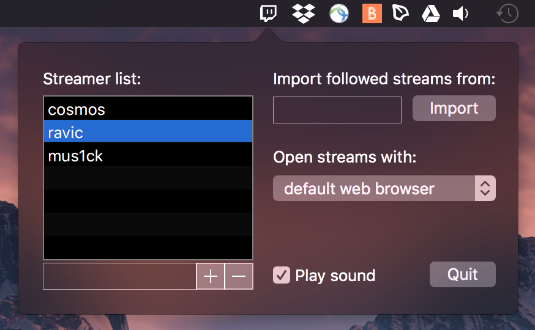

# Live stream checker for Twitch 

This is an application that notifies you whenever one of your favorite game streamers from Twitch (www.twitch.tv) comes online. If you click the notification, it will open the stream.

Main window:

Notification example:

## Download

(still few bugs here and there... testing / debugging it these days)

[Download link](https://github.com/igor25/live_stream_checker/releases/download/v0.93/Live.stream.checker.app.zip) (macOS 10.11+)

Windows 10 version coming soon.

## Description

You can add streamers individually by typing the channel name in the text field below the list and pressing the + button. You can import the list of streamers that are followed by some user by typing that users name in the text field under 'Import followed streams from' and pressing the Import button.

If you click the online notification then the stream opens either in the default browser or using [livestreamer](http://livestreamer.tanuki.se). If more than one streamer comes online on the next check, a stream selector dialog pops so you can choose which stream to launch.

To use [livestreamer](http://livestreamer.tanuki.se) you need to register it with Twitch and obtain your authentication token.

## Technical details

The application checks the status of all streamers on the list every minute. User settings are saved using macOS Preferences (in the .plist file `~/Library/Preferences/com.is.Live-stream-checker`). If, for some reason, you need to edit this file, you can use macOS command `defaults`, e.g. `defaults read com.is.live-stream-checker` to see what can be changed and `defaults write` to change values.

To check streamer status this app launches a Bash `curl` command to query Twitch API as described [here](https://github.com/justintv/Twitch-API), which returns streamer information in a JSON format.

## To do

- Check how the application windows look on a retina screen.

---
Written with Xcode 8.1 / Swift 3.0 on macOS 10.12.1
